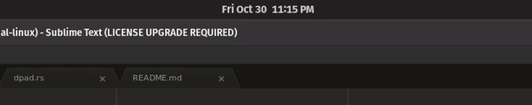

# surface-dial-linux

A Linux userspace controller for the [Microsoft Surface Dial](https://www.microsoft.com/en-us/p/surface-dial/925r551sktgn). Requires Linux Kernel 4.19 or higher.

**DISCLAIMER: This software is still under active development!**

Things will change.
Things will break.
Things are probably buggy.

You've been warned :eyes:

## Overview

`surface-dial-daemon` is a background daemon which recieves raw events and translates them to various actions.

Aside from haptic feedback, the daemon also uses FreeDesktop notifications to provide visual feedback when performing various actions.



It would be cool to create some sort of GUI overlay (similar to the Windows one), though that's out of scope at the moment.

## Implementation

- `libevdev` to read events from the surface dial via `/dev/input/eventXX`
- `libevdev` to fake input via `/dev/uinput` (for keypresses / media controls)
- `hidapi` to configure dial sensitivity + haptics
- `notify-rust` to send notifications over D-Bus

## Functionality

- [x] Interpret raw Surface Dial event
- Operating Modes
    - [x] Volume Controls
    - [x] Media Controls
    - [x] D-Pad (emulated left, right, and space key)
    - [x] Scrolling / Zooming
    - [ ] \(meta\) custom modes specified via config file(s)
- [x] Dynamically switch between operating modes
    - [x] Using some-sort of on-device mechanism (e.g: long-press)
    - [ ] Context-sensitive (based on currently open application)
- [x] Mode Persistence (keep mode when dial disconnects)
- [x] Haptic Feedback
    - https://docs.microsoft.com/en-us/windows-hardware/design/component-guidelines/radial-controller-protocol-implementation
    - https://www.usb.org/sites/default/files/hutrr63b_-_haptics_page_redline_0.pdf
    - https://www.usb.org/sites/default/files/hut1_21.pdf
    - _This was tricky to figure out, but in the end, it was surprisingly straightforward! Big thanks to [Geo](https://www.linkedin.com/in/geo-palakunnel-57718245/) for pointing me in the right direction!_
- [x] Desktop Notifications
    - [x] On Launch
    - [x] When switching between modes
    - [x] When switching between sub-modes (e.g: scroll/zoom)

Feel free to contribute new features!

## Dependencies

Building `surface-dial-daemon` requires the following:

- Linux Kernel 4.19 or higher
- A fairly recent version of the Rust compiler
- `libevdev`
- `hidapi`

You can install Rust through [`rustup`](https://rustup.rs/).

Unless you're a cool hackerman, the easiest way to get `libevdev` and `hidapi` is via your distro's package manager.

```bash
# e.g: on ubuntu
sudo apt install libevdev-dev libhidapi-dev
```

## Building

`surface-dial-daemon` uses the standard `cargo build` flow.

```bash
cargo build -p surface-dial-daemon --release
```

The resulting binary is output to `target/release/surface-dial-daemon`

## Installation

At the moment, the daemon dies whenever the Surface Dial disconnects (which naturally happens after a brief period of inactivity).

Instead of doing the Right Thing :tm: and having the daemon detect when the dial connects/disconnects (PRs appreciated!), I've come up with a [cunning plan](https://www.youtube.com/watch?v=AsXKS8Nyu8Q) to spawn the daemon whenever the Surface Dial connects.

This will only work on systems with `systemd`.

```bash
# Install the `surface-dial-daemon` (i.e: build it, and place it under ~/.cargo/bin/surface-dial-daemon)
# You could also just copy the executable from /target/release/surface-dial-daemon to wherever you like.
cargo install --path .

# IMPORTANT: modify the .service file to reflect where you placed the `service-dial-daemon` executable
vi ./install/surface-dial.service

# create new group for uinput
# (the 99-uinput.rules file changes the group of /dev/uinput to this new group)
sudo groupdadd -f uinput

# add self to the new uinput group and the existing /dev/input group
sudo gpasswd -a $(whoami) uinput
sudo gpasswd -a $(whoami) $(stat -c "%G" /dev/input/event0)

# install the systemd user service
mkdir -p ~/.config/systemd/user/
cp ./install/surface-dial.service ~/.config/systemd/user/surface-dial.service

# install the udev rules
sudo cp ./install/99-uinput.rules /etc/udev/rules.d/99-uinput.rules
sudo cp ./install/50-surface-dial.rules /etc/udev/rules.d/50-surface-dial.rules

# reload systemd + udev
systemctl --user daemon-reload
sudo udevadm control --reload
```

You may need to reboot to have the various groups / udev rules propagate.

## License

At the moment, this software is deliberately unlicensed. I'm not opposed to adding a license at some point, it's moreso that I don't think the project is at the stage where it needs a license.
